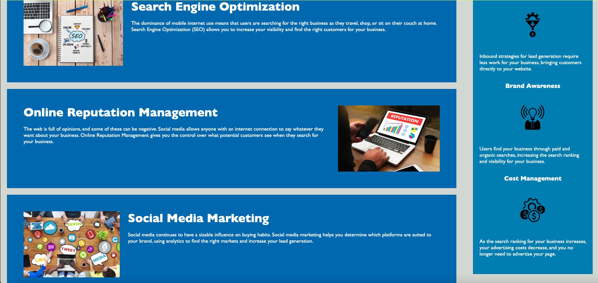

# Semantic Markup

## Description

Fixed html to have the proper semantic markup. By doing so it made the website fit accessibility standards to help ensure it works in all situations. Comments were also added to help clarify what different areas of code do for any future development on website. 

## Installation

N/A

## Usage

Website is used to learn about the company and what it has to offer. The fixed html will be used so that search engines can acess it easily and it will be viewed more by desired customers! Adding comments to the code also help prevent time loss in next development process so everything is understood. 

## Credits

N/A

## License

Please refer to the LICENSE in the repo.

## Badges

## Features

N/A

## How to Contribute

N/A

## Tests

N/A